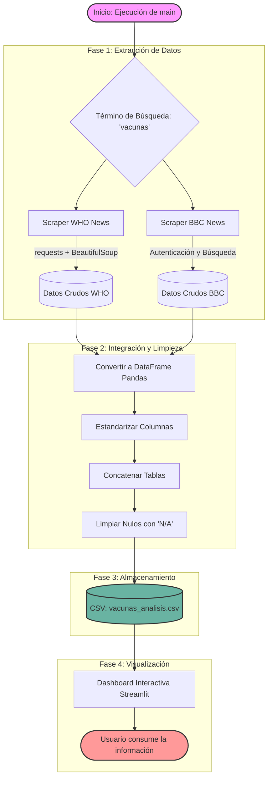

Carlos Enrique Caza Cancho,    CarlosCaza
Cesar Jair Huarac Vega,    notmecj0
Francesco Morote Barboza,    francescomorote-source
Adrián Fabrizio Zuazo Farje,    Azloup

**1. ¿Procesamiento en tiempo real o por lotes (Batch)?**
El sistema está diseñado para ejecutarse **por lotes (Batch)**. 
*Justificación:* Extraer datos mediante Web Scraping (BBC) y APIs (Reddit) en tiempo real generaría un volumen de peticiones excesivo, corriendo el riesgo de que nuestras IPs sean bloqueadas por los servidores al exceder los límites de sus políticas y el `robots.txt`. Además, la información sobre nutrición y dietas no cambia segundo a segundo, por lo que el tiempo real no aporta valor adicional.

**2. ¿Cada cuánto se actualizarán los datos?**
La ejecución del script de extracción está planificada para realizarse **cada 24 horas (diariamente)**. Esto nos permite capturar las nuevas noticias del día y los posts más relevantes (top daily posts) de la comunidad sin sobrecargar las fuentes.

**3. ¿Cómo se almacenarán los datos extraídos?**
Los datos se almacenan en un archivo plano estructurado de formato **CSV** (`vacunas_analisis.csv`). 
*Justificación:* Dado que el volumen objetivo es de decenas o centenas de registros, una base de datos relacional (como SQL) añadiría complejidad innecesaria. El formato CSV es ligero, nativamente compatible con la librería `pandas` utilizada en la Fase 3, y permite que la aplicación de Streamlit (Fase 4) lea la información en milisegundos para renderizar el dashboard.

**4. ¿Cómo se integrarán los datos extraídos de las fuentes?**
El flujo de integración ocurre en el script principal de Python. Los datos crudos extraídos de la BBC (vía BeautifulSoup) y de Reddit (vía PRAW) tienen estructuras distintas iniciales. Mediante `pandas`, se estandarizan las columnas (asignando campos universales como 'Título', 'Fuente', 'URL' y 'Fecha') y se realiza una concatenación (`pd.concat`). Los campos que no aplican para una fuente (como los "Upvotes" que existen en Reddit pero no en la BBC) se manejan rellenando los valores nulos con "N/A", resultando en un único archivo maestro integrado.

