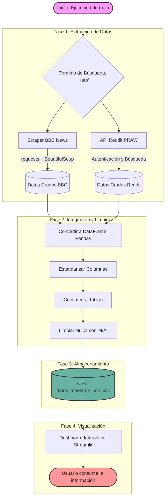

Carlos Enrique Caza Cancho,    CarlosCaza
Cesar Jair Huarac Vega,    
Francesco Morote Barboza,    francescomorote-source
Adrián Fabrizio Zuazo Farje,    Azloup

```mermaid
graph TD
    A([Inicio: Ejecución de main]) --> B{Término de Búsqueda: 'Keto'}

    %% Fase de Extracción
    subgraph Fase 1: Extracción de Datos
        B --> C[Scraper BBC News]
        B --> D[API Reddit PRAW]
        
        C -->|requests + BeautifulSoup| E[(Datos Crudos BBC)]
        D -->|Autenticación y Búsqueda| F[(Datos Crudos Reddit)]
    end

    %% Fase de Transformación
    subgraph Fase 2: Integración y Limpieza
        E --> G[Convertir a DataFrame Pandas]
        F --> G
        G --> H[Estandarizar Columnas]
        H --> I[Concatenar Tablas]
        I --> J[Limpiar Nulos con 'N/A']
    end

    %% Fase de Carga
    subgraph Fase 3: Almacenamiento
        J --> K[(CSV: datos_maestros_keto.csv)]
    end

    %% Fase de Interfaz
    subgraph Fase 4: Visualización
        K --> L[Dashboard Interactiva Streamlit]
        L --> M([Usuario consume la información])
    end
    
    %% Estilos de colores
    style A fill:#f9f,stroke:#333,stroke-width:2px
    style K fill:#69b3a2,stroke:#333,stroke-width:2px
    style M fill:#ff9999,stroke:#333,stroke-width:2px
```
